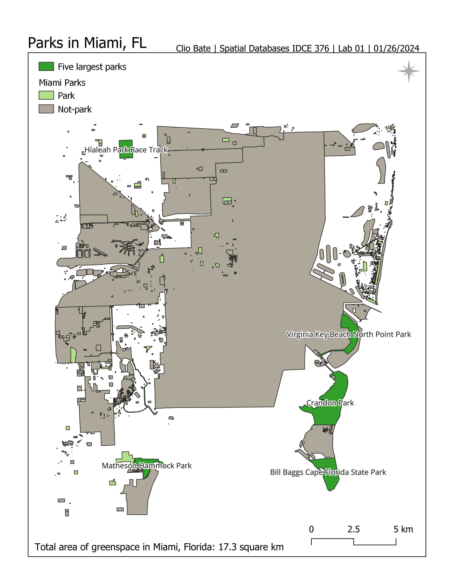

# Urban Green Spaces Project
### Spatial Databases 376 Lab 01  By Clio Bate 01/29/2024
This project was created as part of the class, Spatial Databases at Clark University Spring, 2024. The objective of this assignent is to set up Git/Git Bash on our local machine, and familiarize ourselves with SQL and the software that will be used in this class(PgAdmin 4, QGIS). This will be done through analyzing green spaces in a city of choice. I identified the five largest parks in Miami, calculated the total area of parks within the city, and created a map to visualize my fidnings.

#### Methods
1. Set up Git Bash and create a repository and initiailze it on my local machine- I had already downlowaded and used Git Bash, so I only had to create aned add the reposity, UrbanGreenSpacesProject
2. Chose a city and download the data in pbf format. [Link to data](https://download.bbbike.org/osm/bbbike/Miami/)— I chose Miami, FL.
3. Ceate the a database in PgAdmin using the following code  
`osm2pgsql -d urban_green_spaces -U postgres -W C:\Users\cvale\Clark_Assignments\Databases_S24\UrbanGreenSpacesProject\Miami.osm.pbf`
4. Using SQL query, select all the parks within the database and sort by decending
5. Clean data by removing any null or empty values 
6. Create an empty table called green_spaces
7. Populate green_spaces table with only the parks from the original table
8. Use SQL query to find the top 5 largest parks in the city of choice
9. Use SQL query to calculate the total area of green spaces.
5. Open QGIS and connect to Urban Green Spaces Project
6. Make a map to show findings (see map in repository and image included in visualizations section)
7. Push everything to GitHub

#### Findings
In my analysis of Miami green spaces I found:

1. The total area of green space in Miami is = 17255910.3 sq m 

2. The top 5 largest green spaces by name and area, which are as follows:
- Crandon Park: 4813915.0 sq m
- Bill Baggs Cape Florida State Park: 2125852.9 sq m
- Virginia Key Beach North Point Park: 1683502.5 sq m
- Matheson Hammock Park: 1037290.2 sq m
- Hialeah Park Race Track: 1000239.7 sq m 

#### Visualizations
Map created in QGIS

